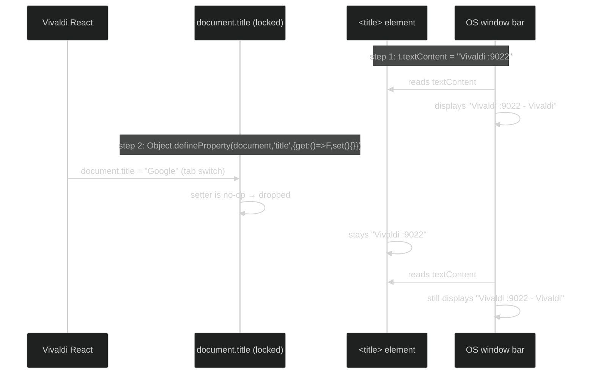
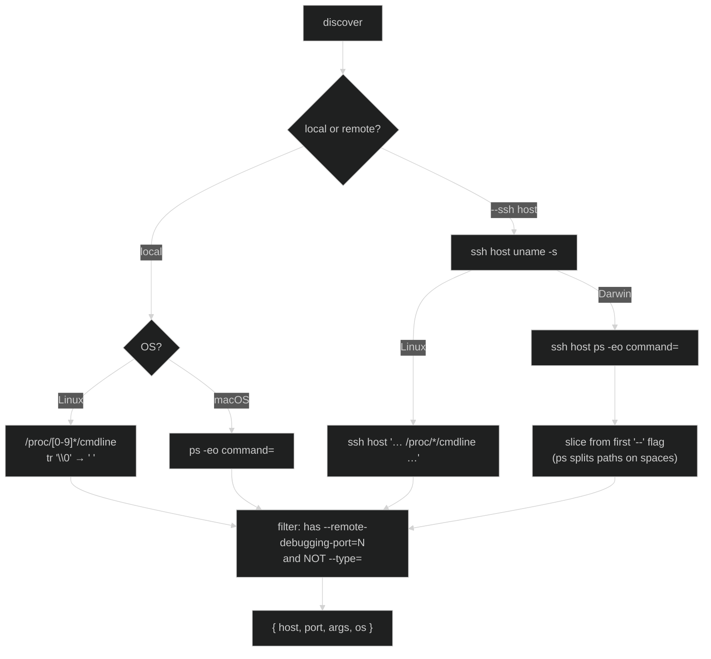
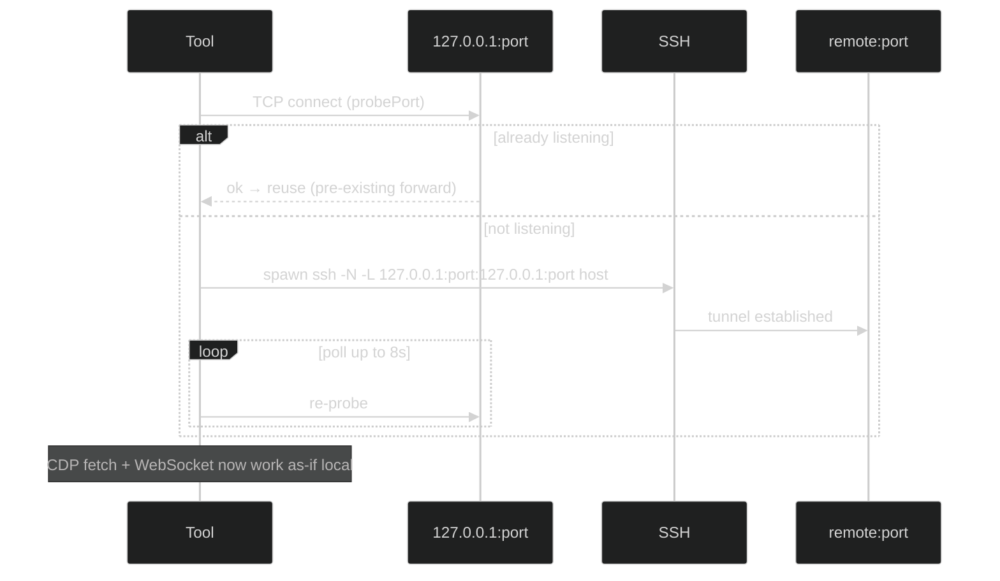
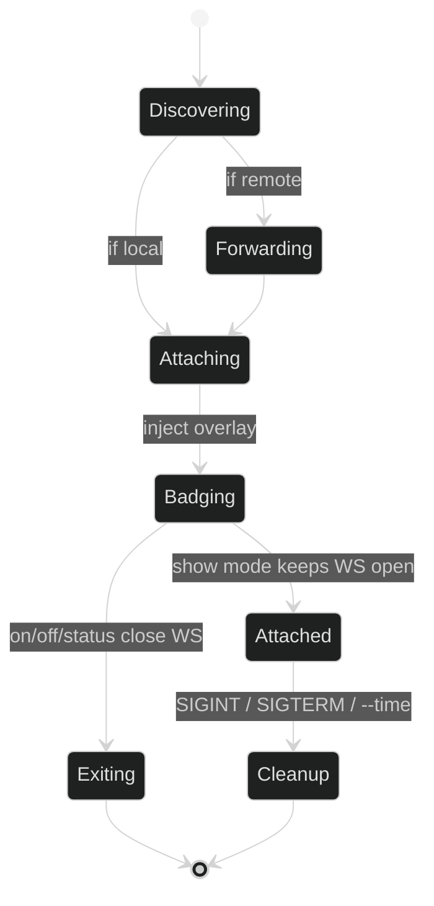

# Vivaldi/Chromium Window Identification & Launch-Args Badge

Companion to `changing-vivaldi-vertical-tab-bar-size.md`, `changing-vivaldi-zoom.md`,
`vivaldi-general-quirks.md`. Tool: `tools/vivaldi-window-title.mjs`.

Two related problems, one tool:
1. **Pin the OS window title** so it stops following the active tab (each CDP instance gets a
   stable, identifiable name).
2. **Flash a launch-args badge** (bottom-right overlay) identifying *which* browser this is and
   *how it was launched* — across the local machine **and** remote SSH hosts, auto-discovered.

## Problem 1 — the OS title follows the active tab

Vivaldi drives the OS window bar by writing `document.title = <active tab title>` inside the
`window.html` chrome target. So the window title is useless for identifying *which browser
instance* this is — it just echoes whatever page is open.

### Discovery: only one write path

Vivaldi uses **only** the `document.title = ...` JS path to update the title. It does **not**
directly mutate the `<title>` element's `textContent`. The OS, however, reads the `<title>`
element. This asymmetry is the entire trick:

| Actor | Uses |
|-------|------|
| Vivaldi's React state | `document.title = ...` (JS setter) |
| The OS window bar | `<title>` element textContent |

### The pin recipe

1. Write the desired value directly into the `<title>` element (`t.textContent = F`) — the OS
   picks this up immediately.
2. Override `document.title` with a **getter-only** property descriptor whose setter is a
   no-op. Now every future `document.title = <tab>` from Vivaldi is silently dropped.



Verified: tab switches flip `window.__vivaldiSeenTitle` (blocked) but the OS bar never changes.
Confirmed live via `wmctrl -l` on Linux.

### Gotcha: never override `<title>` element setters

An earlier attempt also overrode `title.textContent`/`title.innerText` to be safe. This
**backfired**: the lock survived in `window.html`'s JS memory but the OS bar read a stale value
because the element's real content was masked. Lesson: lock **only** `document.title`; let the
`<title>` element receive the real value normally. The `off` step recreates a fresh `<title>`
element to shed any leftover property descriptors.

## Problem 2 — the launch-args badge

Same "which instance is this?" question, but for *humans looking at the screen*. Goal: flash a
big bottom-right card showing the port + real launch flags, like an OS "identify monitor"
overlay.

### Why a DOM overlay and not a native window

The `window.html` context is a normal renderer — injecting a `<div>` with `position:fixed;
z-index:2147483647` lands it on top of the entire chrome. No native-toolkit dependency, and the
same injection works for any CDP target (Vivaldi chrome, VS Code Electron page, etc.).

### Target resolution

The tool attaches to CDP targets in priority order:

| Priority | Filter | Works for |
|----------|--------|-----------|
| 1st | `type === 'app'` + url contains `window.html` | Vivaldi chrome |
| 2nd (fallback, `show` mode only) | `type === 'page'` (first with WS URL) | VS Code Electron, plain Chromium |

The fallback is what made the badge work on port `9032` (VS Code Extension Development Host) —
it has no `window.html`, just a single Electron `page` target.

### Badge anatomy

```
┌─────────────────────────────┐
│ @mac  LINUX↗  ← host + os pill (only when remote/detected)
│                              │
│ :9022          ← big port    │
│ LAUNCH ARGS                  │
│ --remote-debugging-port=9022 │
│ --user-data-dir=…            │
│ ─────────────────── (5s bar) │  ← only when not persistent
│ Ctrl+C to exit               │  ← only when persistent
└─────────────────────────────┘
   bottom:24px  right:24px
```

Two modes control the bottom strip:

| Mode | Strip | Behavior |
|------|-------|----------|
| `on` (pin) | 5s countdown bar | flashes, then fades |
| `show` (attached) | "Ctrl+C to exit" or "closing in Ns…" | stays until SIGINT or `--time` fires |

## Discovery — where do the instances come from?

The tool auto-discovers every `--remote-debugging-port=N` process so you rarely pass ports
explicitly. Discovery branches by OS:



### The `/proc` ≠ null-separated gotcha (Vivaldi only)

Normal Linux processes store `/proc/<pid>/cmdline` as **NUL-separated** argv. Vivaldi (and
Chromium-based browsers) **rewrite their own argv** so the main process's cmdline is
**space-separated** — confirmed by hexdump:

| Byte offset | Content |
|-------------|---------|
| `0x00` | `/opt/vivaldi/vivaldi-bin ` (space, not NUL!) |
| … | `--remote-debugging-port=9022 --user-data-dir=…` |
| `0x7e` | `.← only the final NUL` |

The parser normalizes `\0 → space` then `split(/\s+/)`, which handles both formats (real
null-separated processes like the crashpad handler still parse correctly).

### The macOS `ps` path-splitting gotcha

`ps -eo command=` on macOS splits the command on spaces, so an app path like
`/Applications/Vivaldi Snapshot.app/…/Vivaldi Snapshot` arrives as several tokens. Fix: when
extracting args, **slice from the first token starting with `--`** — the binary path (however
fragmented) is dropped and only real flags remain.

### SSH port forwarding

Remote CDP ports aren't reachable directly. The tool probes `127.0.0.1:<port>` and either
**reuses** an existing forward (common — many users keep `LocalForward` in `~/.ssh/config`) or
**spawns a managed `ssh -N -L` tunnel**. Spawned tunnels are tracked and killed on cleanup so
nothing leaks.



## Lifecycle — attach and cleanup



### Cleanup contract

The cleanup handler runs on SIGINT, SIGTERM, **and** the `--time` timer. It is **idempotent**
(flag-guarded) so `Ctrl+C` racing the timer doesn't double-fire. For each attached target:

1. `Runtime.evaluate` → remove the badge `<div>` from the live DOM
2. `ws.close()` the WebSocket
3. `SIGTERM` every spawned ssh tunnel child

This guarantees no badge ghosts remain on screen and no `ssh -N` processes linger after exit.

## CLI surface

| Arg | Effect |
|-----|--------|
| `show` | attach + persist badge (stays until Ctrl+C / `--time`) |
| `on` (default) | pin title + flash 5s badge |
| `"<text>"` | pin a custom title instead of `Vivaldi :<port>` |
| `off` | drop the lock, restore active-tab behaviour |
| `status` | report lock state as JSON |
| `<ports...>` | explicit local ports (else auto-discover) |
| `--ssh h1,h2,…` | also discover + badge remote hosts (additive to local) |
| `--time N` | auto-exit after N seconds (badge shows countdown) |

```bash
node tools/vivaldi-window-title.mjs show                       # all local instances, attached
node tools/vivaldi-window-title.mjs show --ssh mac             # local + mac, attached
node tools/vivaldi-window-title.mjs show --ssh mac,nuc --time 10
node tools/vivaldi-window-title.mjs on 9022                    # pin + 5s flash
```

## Cross-host instance matrix (this setup)

| Port | Host | OS | App |
|------|------|----|-----|
| 9022 | (local) | linux | Vivaldi |
| 9023 | (local) | linux | Vivaldi (`--ignore-certificate-errors`) |
| 9032 | (local) | linux | VS Code Electron (Ext. Dev Host) |
| 9221 | mac | macos | Vivaldi Snapshot (beta) |
| 9222 | mac | macos | Vivaldi (stable) |

Ports 9221/9222 were already `LocalForward`'d in the user's ssh config, so the tool reuses
those tunnels (no spawn needed). The badge's orange `@host` tag + green `LINUX`/`MACOS` pill
disambiguates mixed-host fleets at a glance.

## Key takeaways

- **`document.title` is Vivaldi's only update path**; a getter-only property descriptor is a
  permanent lock. Don't touch the `<title>` element's own setters.
- **The badge is just a fixed-position `<div>`** — any CDP renderer with a `document.body`
  works, including non-Vivaldi Electron apps.
- **Discovery is OS-aware**: `/proc` (null→space normalized) on Linux, `ps` on macOS, gated by
  remote `uname -s` over SSH.
- **Forwarding is opportunistic**: reuse if listening, else own a child `ssh -N -L` and kill it
  on cleanup.
- **Cleanup is idempotent and signal/timer-agnostic** — removes DOM, closes WS, kills tunnels.

## Related

- `docs/important/vivaldi-general-quirks.md` — the `window.html` target, trusted-input rule,
  stale-pref rule (this tool inherits all of them)
- `docs/important/changing-vivaldi-vertical-tab-bar-size.md` — finding `window.html`,
  `webSocketDebuggerUrl`, Runtime.evaluate-from-chrome pattern
