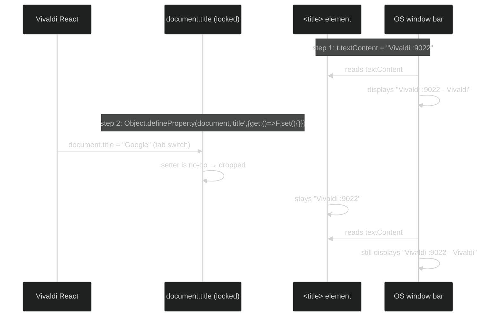
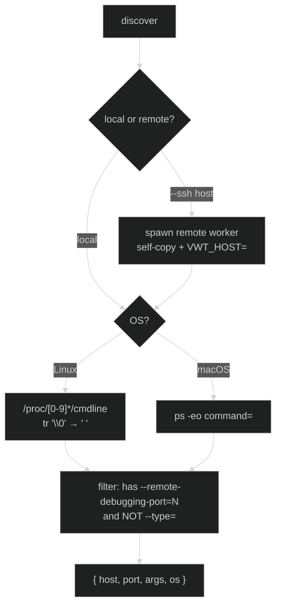
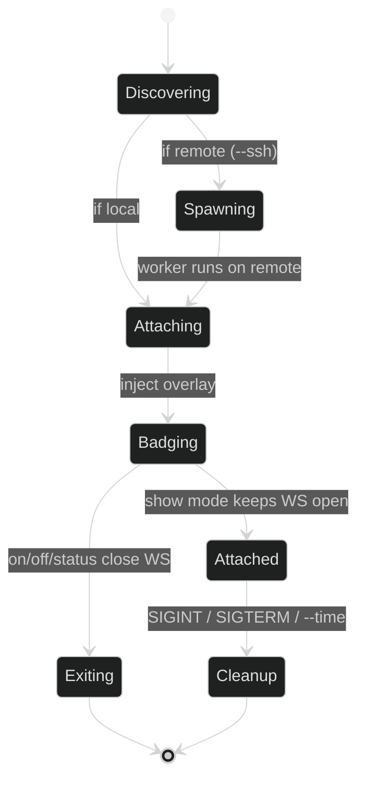

# Vivaldi/Chromium Window Identification & Launch-Args Badge

Companion to `changing-vivaldi-vertical-tab-bar-size.md`, `changing-vivaldi-zoom.md`,
`vivaldi-general-quirks.md`. Tool: `tools/show-cdp-ports.mjs`.

Two related problems, one tool:
1. **Pin the OS window title** so it stops following the active tab (each CDP instance gets a
   stable, identifiable name).
2. **Flash a launch-args badge** (bottom-right overlay) identifying *which* browser this is and
   *how it was launched* — across the local machine **and** remote SSH hosts, auto-discovered.

## Problem 1 — the OS title follows the active tab

Vivaldi drives the OS window bar by writing `document.title = <active tab title>` inside the
`window.html` chrome target. So the window title is useless for identifying *which browser
instance* this is — it just echoes whatever page is open.

### Discovery: only one write path

Vivaldi uses **only** the `document.title = ...` JS path to update the title. It does **not**
directly mutate the `<title>` element's `textContent`. The OS, however, reads the `<title>`
element. This asymmetry is the entire trick:

| Actor | Uses |
|-------|------|
| Vivaldi's React state | `document.title = ...` (JS setter) |
| The OS window bar | `<title>` element textContent |

### The pin recipe

1. Write the desired value directly into the `<title>` element (`t.textContent = F`) — the OS
   picks this up immediately.
2. Override `document.title` with a **getter-only** property descriptor whose setter is a
   no-op. Now every future `document.title = <tab>` from Vivaldi is silently dropped.



Verified: tab switches flip `window.__vivaldiSeenTitle` (blocked) but the OS bar never changes.
Confirmed live via `wmctrl -l` on Linux.

### Gotcha: never override `<title>` element setters

An earlier attempt also overrode `title.textContent`/`title.innerText` to be safe. This
**backfired**: the lock survived in `window.html`'s JS memory but the OS bar read a stale value
because the element's real content was masked. Lesson: lock **only** `document.title`; let the
`<title>` element receive the real value normally. The `off` step recreates a fresh `<title>`
element to shed any leftover property descriptors.

## Problem 2 — the launch-args badge

Same "which instance is this?" question, but for *humans looking at the screen*. Goal: flash a
big bottom-right card showing the port + real launch flags, like an OS "identify monitor"
overlay.

### Why a DOM overlay and not a native window

The `window.html` context is a normal renderer — injecting a `<div>` with `position:fixed;
z-index:2147483647` lands it on top of the entire chrome. No native-toolkit dependency, and the
same injection works for any CDP target (Vivaldi chrome, VS Code Electron page, etc.).

### Target resolution

The tool attaches to CDP targets in priority order:

| Priority | Filter | Works for |
|----------|--------|-----------|
| 1st | `type === 'app'` + url contains `window.html` | Vivaldi chrome |
| 2nd (fallback, `show` mode only) | `type === 'page'` (first with WS URL) | VS Code Electron, plain Chromium |

The fallback is what made the badge work on port `9032` (VS Code Extension Development Host) —
it has no `window.html`, just a single Electron `page` target.

### Badge anatomy

```
┌─────────────────────────────┐
│ @mac  LINUX↗  ← host + os pill (only when remote/detected)
│                              │
│ :9022          ← big port    │
│ LAUNCH ARGS                  │
│ --remote-debugging-port=9022 │
│ --user-data-dir=…            │
│ ─────────────────── (5s bar) │  ← only when not persistent
│ closing in 3s…               │  ← persistent: live countdown (default 3s)
└─────────────────────────────┘
   bottom:30px  right:30px
```

Two modes control the bottom strip:

| Mode | Strip | Behavior |
|------|-------|----------|
| `on` (pin) | 5s countdown bar | flashes, then fades |
| `show` (attached) | "closing in Ns…" live countdown | stays until `--time` (default 3s) or SIGINT fires |

## Discovery — where do the instances come from?

The tool auto-discovers every `--remote-debugging-port=N` process so you rarely pass ports
explicitly. Discovery branches by OS, and **runs where the browser runs**:



No `ssh -G`/`uname` round-trips for discovery: the remote worker re-runs the **same** local
discovery code (`/proc` or `ps`) natively on the remote box, so it sees `127.0.0.1:<port>`
directly. Only the node binary lookup goes over SSH (see below).

### The `/proc` ≠ null-separated gotcha (Vivaldi only)

Normal Linux processes store `/proc/<pid>/cmdline` as **NUL-separated** argv. Vivaldi (and
Chromium-based browsers) **rewrite their own argv** so the main process's cmdline is
**space-separated** — confirmed by hexdump:

| Byte offset | Content |
|-------------|---------|
| `0x00` | `/opt/vivaldi/vivaldi-bin ` (space, not NUL!) |
| … | `--remote-debugging-port=9022 --user-data-dir=…` |
| `0x7e` | `.← only the final NUL` |

The parser normalizes `\0 → space` then `split(/\s+/)`, which handles both formats (real
null-separated processes like the crashpad handler still parse correctly).

### The macOS `ps` path-splitting gotcha

`ps -eo command=` on macOS splits the command on spaces, so an app path like
`/Applications/Vivaldi Snapshot.app/…/Vivaldi Snapshot` arrives as several tokens. Fix: when
extracting args, **slice from the first token starting with `--`** — the binary path (however
fragmented) is dropped and only real flags remain.

### Remote execution (no port forwarding)

Remote CDP ports are bound to `127.0.0.1` on the remote box and are unreachable from here, so
the tool **does not forward them at all**. Instead it self-copies the script and runs it on the
remote with the remote's own node:

1. **Node lookup** — `ssh <host> 'bash -ic "command -v node"'` (`.bashrc` early-returns on
   non-TTY, so interactive rc-sourcing is required to find conda/brew nodes), with a fallback
   list of well-known paths. Node must be ≥ **v18** (global `fetch`/`WebSocket`/`AbortController`).
2. **Cache** — the resolved binary is cached at
   `~/.cache/show-cdp-ports/node-paths.json`, keyed by the **resolved** host
   (`user@hostname:port` from `ssh -G`). Each run just probes `test -x` + `--version` on the
   cached path (~1 cheap ssh); it only re-discovers when that path is gone, or with
   `--refresh-node`.
3. **Self-copy** — `mktemp -d` on the remote, pipe this script into `<dir>/worker.mjs`.
4. **Execute** — `VWT_HOST=<host> VWT_BADGE_CFG=<base64> <node> <worker.mjs> --worker <orig args>`
   over `ssh -T`, stdio inherited so tagged logs stream back. The worker re-runs the whole local
   pipeline against the remote's `127.0.0.1:<port>` — no tunnels, no port collisions, no
   `ssh -N` to manage. `VWT_BADGE_CFG` carries the local badge config to the worker so remote
   badges match.

```mermaid
sequenceDiagram
    %%{init: {'theme': 'dark'}}%%
    participant L as Launcher (local node)
    participant S as ssh
    participant R as Remote worker (node)
    L->>S: ssh -G host → resolved user@host:port
    L->>R: probe cached node (test -x && --version)
    alt cache hit & good
        R-->>L: reuse path
    else cache miss / --refresh-node
        L->>R: bash -ic "command -v node" (+fallbacks)
        R-->>L: path → write cache
    end
    L->>R: mktemp -d; cat self > worker.mjs
    L->>R: VWT_HOST=host VWT_BADGE_CFG=… node worker.mjs --worker <args>
    R->>R: own /proc|ps discovery → 127.0.0.1:port
    R->>R: CDP attach → inject badge
    R-->>L: tagged logs via ssh stdout
```

## Lifecycle — attach and cleanup



### Cleanup contract

The cleanup handler runs on SIGINT, SIGTERM, SIGHUP, **and** the `--time` timer. It is
**idempotent** (flag-guarded) so `Ctrl+C` racing the timer doesn't double-fire. Locally (and in
each remote worker):

1. `Runtime.evaluate` → remove the badge `<div>` from the live DOM
2. `ws.close()` the WebSocket
3. `SIGTERM` every spawned ssh child, then `rm -rf` the remote tmp dir (worker also self-cleans
   via `rm -f` + `rmdir` after it exits)

This guarantees no badge ghosts remain on screen, no `ssh -N` processes linger, and no worker
scripts or tmp dirs leak on the remote. `show` defaults to a **3s auto-exit** (configurable via
`time` in `~/.config/cdp-show-badge/config.json`) so a killed parent can never orphan a worker:
the worker carries its own `--time`, and even if the ssh pipe dies (parent SIGKILLed), the
page-side **heartbeat watchdog** (refreshed every 2s by the worker, self-removes the badge within
~6s of it stopping) cleans up the screen. The launcher stays alive only while local `attached`
WS connections or remote workers are live; non-persistent modes (`on`/`off`/`status`) exit as
soon as their work is done.

## Badge config — `~/.config/cdp-show-badge/config.json`

Badge appearance, position, and the `show` auto-exit default are configurable via a JSON file
(local only; remote workers receive it from the launcher via the `VWT_BADGE_CFG` env var). All
keys optional:

```json
{
  "time": 3,
  "opacity": 0.8,
  "width": 300,
  "position": { "bottom": 30, "right": 30 }
}
```

| Key | Effect |
|-----|--------|
| `time` | `show` auto-exit seconds when `--time` isn't given (default 3) |
| `opacity` | badge opacity 0..1 (default 0.8) |
| `width` | badge `max-width` px (default 300) |
| `position` | `top`/`bottom`/`left`/`right` px offsets; giving `top` or `left` drops the matching `bottom`/`right` default |

## CLI surface

| Arg | Effect |
|-----|--------|
| `show` | attach + persist badge (stays until Ctrl+C / `--time`; **default 3s auto-exit**) |
| `on` (default) | pin title + flash 5s badge |
| `"<text>"` | pin a custom title instead of `Vivaldi :<port>` |
| `off` | drop the lock, restore active-tab behaviour |
| `status` | report lock state as JSON |
| `<ports...>` | explicit local ports (else auto-discover) |
| `--ssh h1,h2,…` | also badge remote hosts (additive to local; runs on-remote if node ≥ v18) |
| `--time N` | auto-exit after N seconds (badge shows countdown; `show` defaults to 3) |
| `--refresh-node` | discard cached remote node path, force re-discovery |

```bash
node tools/show-cdp-ports.mjs show                       # all local instances, attached
node tools/show-cdp-ports.mjs show --ssh mac             # local + mac, attached
node tools/show-cdp-ports.mjs show --ssh pp,mac --time 10
node tools/show-cdp-ports.mjs on 9022                    # pin + 5s flash
node tools/show-cdp-ports.mjs status --ssh pp --refresh-node
```

## Cross-host instance matrix (this setup)

| Port | Host | OS | App |
|------|------|----|-----|
| 9022 | (local) | linux | Vivaldi |
| 9023 | (local) | linux | Vivaldi (`--ignore-certificate-errors`) |
| 9032 | (local) | linux | VS Code Electron (Ext. Dev Host) |
| 9221 | mac | macos | Vivaldi Snapshot (beta) |
| 9222 | mac | macos | Vivaldi (stable) |

Remote instances need **no LocalForward** anymore — the tool runs a worker on the remote box
against its own `127.0.0.1:<port>`. The badge's orange `@host` tag + green `LINUX`/`MACOS` pill
disambiguates mixed-host fleets at a glance.

## Key takeaways

- **`document.title` is Vivaldi's only update path**; a getter-only property descriptor is a
  permanent lock. Don't touch the `<title>` element's own setters.
- **The badge is just a fixed-position `<div>`** — any CDP renderer with a `document.body`
  works, including non-Vivaldi Electron apps.
- **Discovery is OS-aware and runs where the browser runs**: `/proc` (null→space normalized) on
  Linux, `ps` on macOS — locally, or in a spawned remote worker via `--ssh`.
- **Remote hosts execute the script in place** — no `ssh -L` forwarding, no port choosing, no
  `LocalForward` reuse. Just a node binary (≥ v18, cached per host) + self-copy + `--worker`.
- **Every CDP round-trip is timeout-guarded** (`/json/list` 2s, WS open 3s, `Runtime.evaluate`
  5s) — a wedged listener is skipped with a warning, never an infinite hang.
- **Cleanup is idempotent and signal/timer-agnostic** — removes DOM, closes WS, SIGTERMs ssh
  children, and `rm -rf`s the remote tmp dir.

## Related

- `docs/important/vivaldi-general-quirks.md` — the `window.html` target, trusted-input rule,
  stale-pref rule (this tool inherits all of them)
- `docs/important/changing-vivaldi-vertical-tab-bar-size.md` — finding `window.html`,
  `webSocketDebuggerUrl`, Runtime.evaluate-from-chrome pattern
